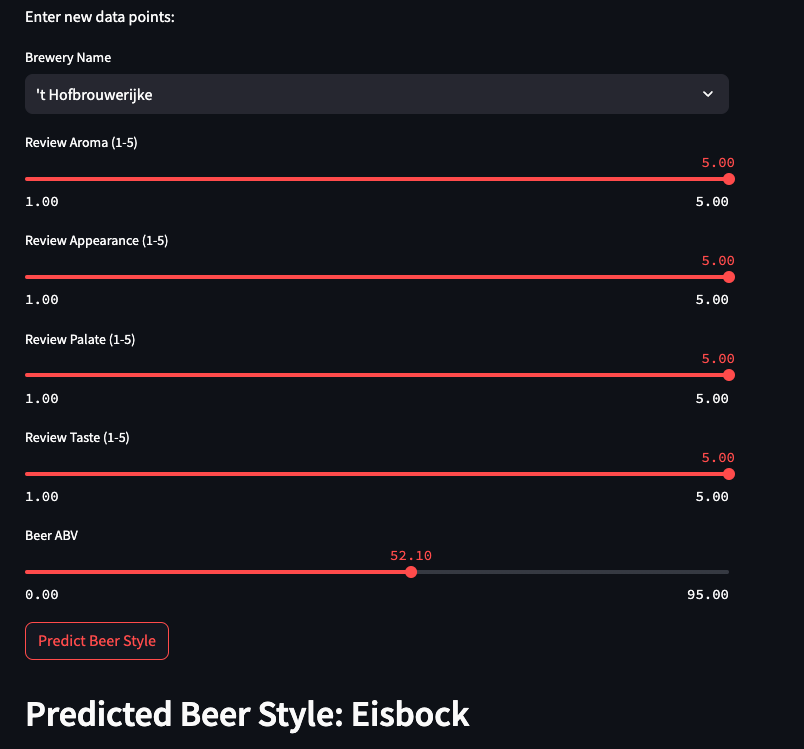

# Beer Style Predictor Streamlit App

## Overview

The Beer Style Predictor is a Streamlit web application designed to predict the style of beer based on user-provided data. This app uses a pre-trained K-Nearest Neighbors (KNN) model to make predictions.



## Usage 

1. Select a brewery name from a sorted dropdown menu.
2. Input beer characteristics on a scale of 1 to 5.
3. Click the "Predict Beer Style" button to see the predicted beer style.

## Running Locally
### Prerequisites for running locally

Before running the app, ensure you have the following dependencies installed:

- Python
- Streamlit
- NumPy
- pandas
- joblib

Install throug:

```bash
pip install -r requirements.txt
```

### Run web app

```bash
streamlit run beer_style_app.py
```

### Running online
